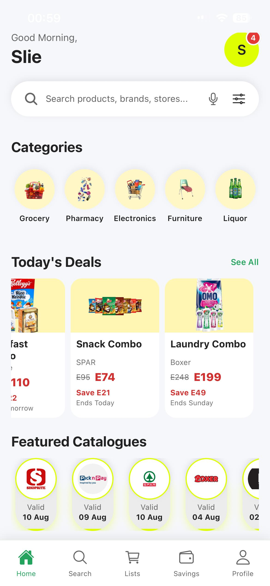
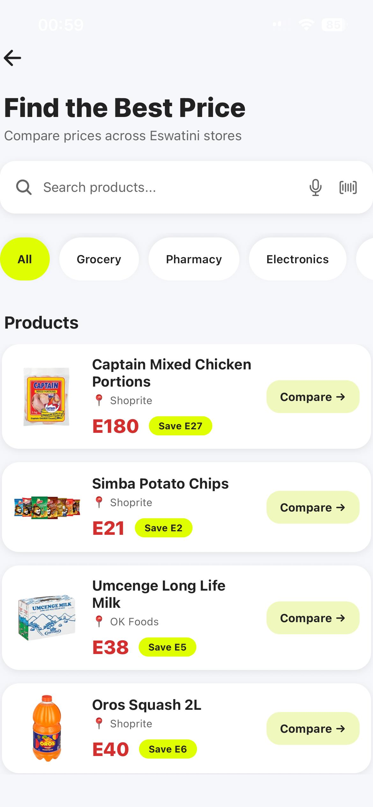
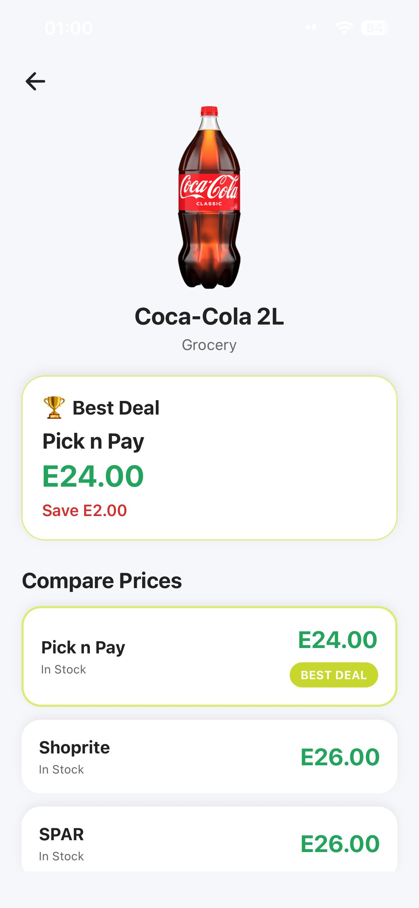
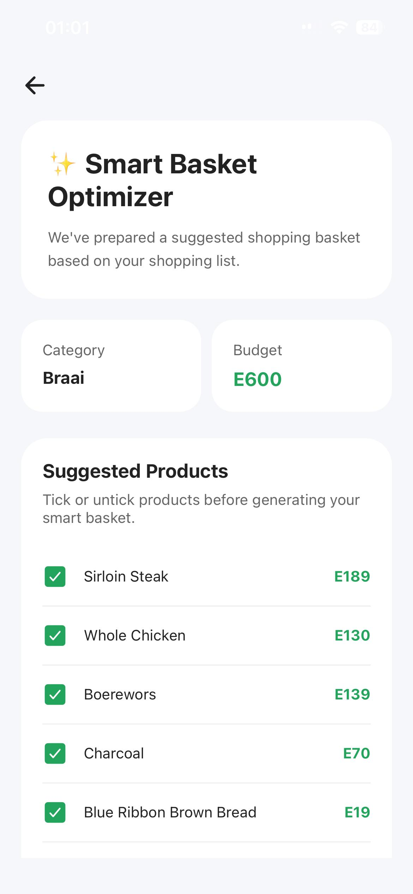
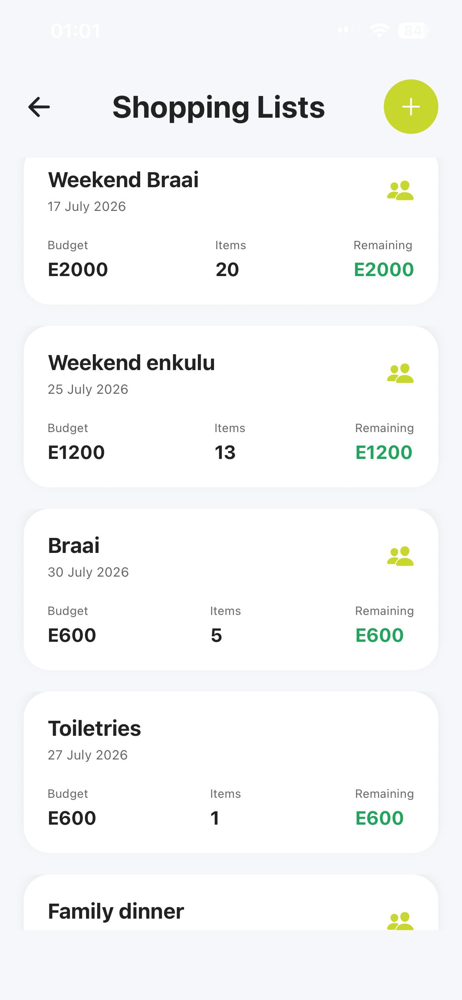
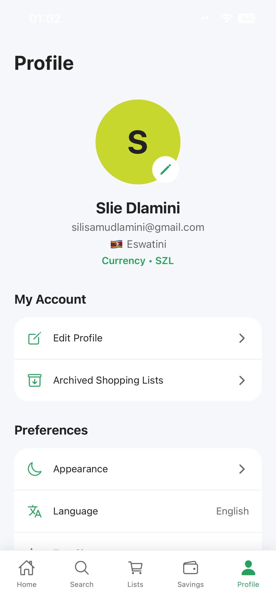

# BreadCrumb

*A smarter way to shop. Compare prices, save money, and never miss the best deal.*

---

## About BreadCrumb

BreadCrumb is a cross-platform mobile price comparison application developed to help consumers make smarter shopping decisions by comparing product prices across multiple supermarkets, pharmacies, electronics stores, furniture stores, and liquor retailers in Eswatini.

Instead of visiting several stores or browsing multiple catalogues, BreadCrumb brings prices together in one place, allowing users to compare products, discover promotions, manage shopping lists, and optimize their shopping baskets for maximum savings.

---

## Why the name "BreadCrumb"?

The name **BreadCrumb** is inspired by the classic idea of **following breadcrumbs to find your way**.

Just as breadcrumbs create a trail that leads someone to their destination, BreadCrumb guides shoppers toward **the cheapest prices and the best deals** available.

Every comparison, catalogue, and price recommendation becomes another "breadcrumb" leading users closer to saving money. Rather than wandering between supermarkets trying to find the lowest price, the app provides a clear trail to the most affordable shopping choices.

---

# Features

- Search thousands of products
- Compare prices across multiple stores
- Find the cheapest retailer instantly
- Create and manage shopping lists
- Smart Basket Optimizer
- Track your savings
- Price drop notifications
- Browse digital store catalogues
- Share shopping lists with family
- Dark Mode
- Adjustable text size for accessibility
- Secure Firebase Authentication
- User profile management

---

# Application Screens

- Splash Screen
- Onboarding
- Login & Registration
- Dashboard
- Search
- Product Comparison
- Product Details
- Shopping Lists
- Shopping List Details
- Smart Basket Optimizer
- Savings
- Store Catalogues
- Notifications
- Profile
- Accessibility Settings

---

# Application Screenshots

  
  
  

  
  
  

# Technologies Used

## Mobile Application

- React Native
- Expo SDK 54
- JavaScript (ES6)

## Backend

- Node.js
- Express.js

## Database

- MongoDB Atlas
- Mongoose

## Authentication

- Firebase Authentication

## Cloud Services

- Firebase
- MongoDB Atlas

## Development Tools

- Visual Studio Code
- Git
- GitHub
- Figma
- Postman
- MongoDB Compass

---

# Author

**Silindinkosi Samkelisiwe Dlamini**

Bachelor of Science in Software Engineering

2026

---
